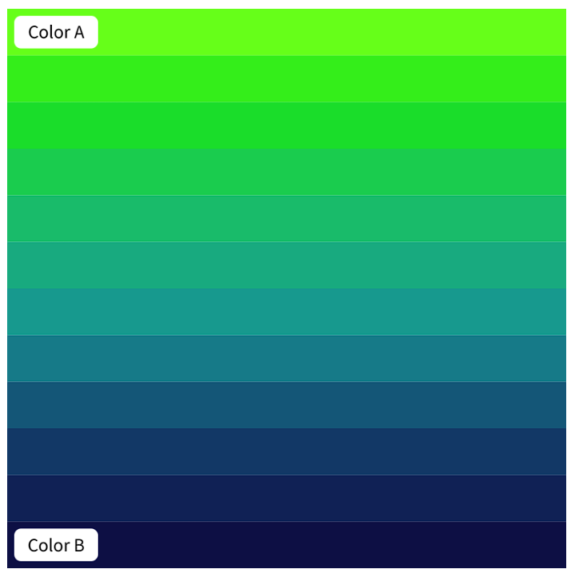
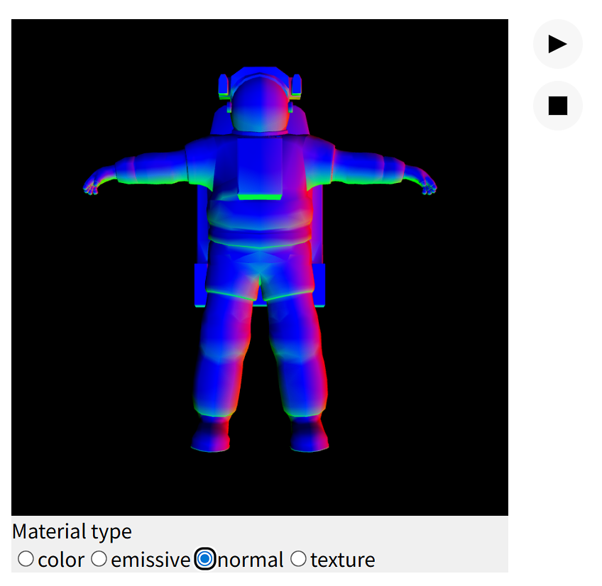

# jwan0684_9103_tut01 Quiz8
## Part 1 **Imaging Technique Inspiration**
I am inspired by cinematic light and shadow transitions used in films and immersive installation artworks. I will add moving light sources, changing shadow lengths, and colour transitions into my project. These techniques create emotional environments that evolve over time instead of responding instantly, fitting the theme of “time-based” mechanics. Like Paul Sermon’s interactive works and The Weather Project, I want the audience to become part of the temporal environment. Through interaction, viewers’ movement and shadows will merge with the changing atmosphere, allowing them to actively experience time rather than simply observe it.
### **Reference Images**
- **Pictures**
    - *Picture 1*

    - *Picture 2*

- **Inspiration Links**
    - *Link 1*
[Inspiration link1](https://olafureliasson.net/artwork/the-weather-project-2003/)
    - *Link 2*
[Inspiration link2](https://www.lozano-hemmer.com/pulse_room.php)
    - *Link 3*
[Inspiration link3](https://whitney.org/collection/works/15286)
## Part 2 **Coding Technique Exploration**
I want to explore four p5.js techniques: colour interpolation, clock-based timing, linear interpolation, and material lighting. Color Interpolation can create gradual colour and lighting transitions between different atmospheric states such as morning, sunset, and night. Clock-based timing systems can structure visual phases over time.linear interpolation can create delayed shadows and fading light trails, allowing shadows to behave like visual memories. Material lighting can simulate how different surfaces react to light. Together, these techniques can create a temporal light environment where colour, shadow, and atmosphere continuously evolve. I hope these techniques can make our work as engaging and immersive as possible, with a strong sense of realism.
### **Reference Images**
- **Pictures**
    - *Picture 1*

    - *Picture 2*

- **Coding Technique References**
    - *Link 1*
[Inspiration link1](https://p5js.org/examples/repetition-color-interpolation/)
    - *Link 2*
[Inspiration link2](https://p5js.org/examples/calculating-values-clock/)
    - *Link 3*
[Inspiration link3](https://p5js.org/examples/calculating-values-interpolate/)
    - *Link 4*
[Inspiration link4](https://p5js.org/examples/3d-materials/)